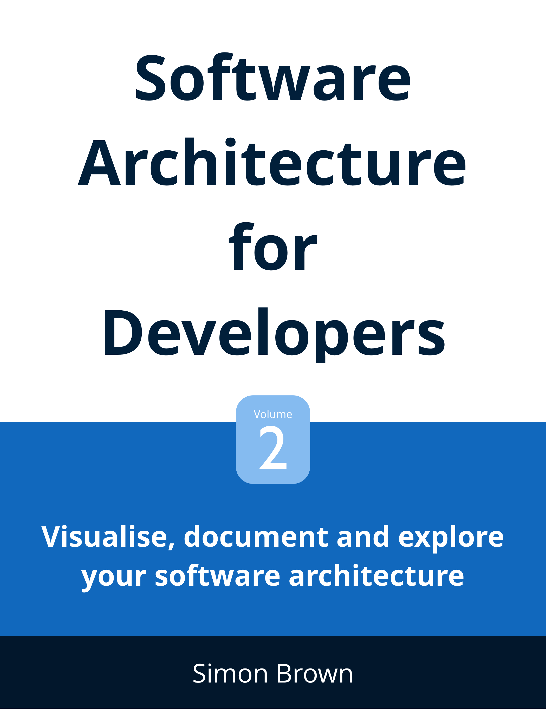

# Software Architecture for Developers

This repository includes the example diagrams used in [Software Architecture for Developers - Volume 2: Visualise, document and explore your software architecture](https://leanpub.com/visualising-software-architecture). It includes examples for Structurizr, StarUML, PlantUML and OmniGraffle.

